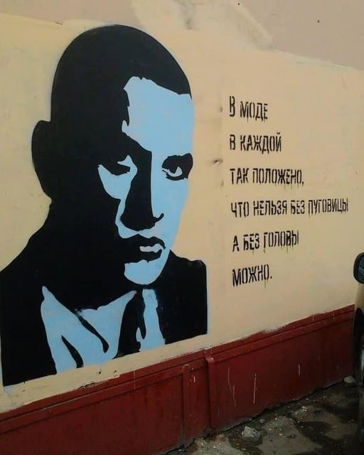
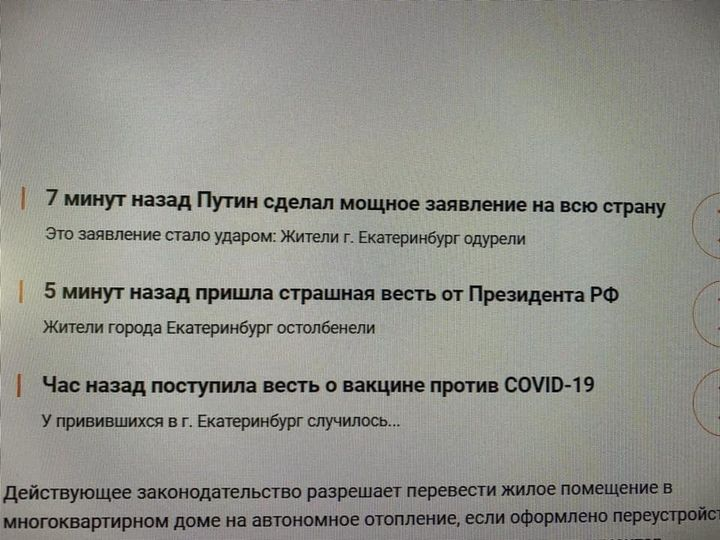
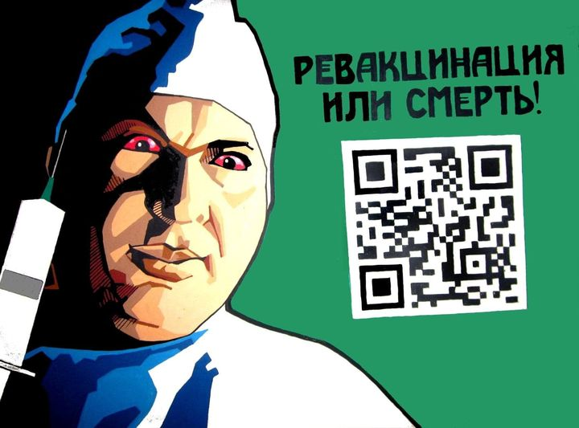
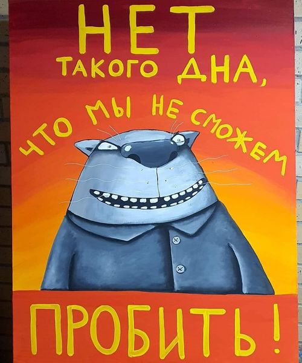

# Хроники Ковидария

Хроники Ковидария - серия постов в Facebook, написанная мною еще до войны. Посты задумывались как юмористические, и в то же время - жгучие, злободневные и грустные. Такими они были, когда еще не было войны. Такими они и останутся: этот проект больше не продолжается. Для посмеяться и подумать.

----

### 26.07.2021

Хроники ковидария.

В Госдуме предложили вернуть графу "национальность" в паспорта. В Кремле не видят необходимости в масштабировании властями производства вакцин.

Губернатор Томской области Сергей Жвачкин приказал снять с фасада Томского театра афишу спектакля "Сережа очень тупой".

77-летний Геннадий Зюганов назвал 62-летнего мэра Новосибирска Анатолия Локтя "перспективным политиком и возможным кандидатом в президенты РФ".

Привитый мэр Южно-Сахалинска заразился коронавирусом. В Абакане тем временем проходил крестный ход против COVID-19...

----
### 31.07.2021

Хроники ковидария.

Израильские спортсмены решили бросить вызов антисекс-кроватям в Олимпийской деревне.

Налоговая подала на банкротство выпускавшей керамические бронежилеты Новосибирской дочки РосНано.

Роскомнадзор потратит 57 миллионов рублей на слежку за публичными сетями WiFi.

Цифровые сервисы принесли Сбербанку 19 миллиардов рублей убытка.

Россия срывает поставки вакцины Спутник V по всему миру.

Путин назначил Мединского главой комиссии по историческому просвещению…

----

### 01.08.2021

Хроники ковидария.

В Николаеве мужчина, опоздавший на трамвай, обогнал его и бежал перед ним по колее несколько кварталов, показывая средний палец.

Фотограф обвинил модный бренд Vetements в плагиате. Компания якобы скопировала образы бездомного из Львова по имени Славик.

Жителю Карасука в морге отдали чужое тело. Он приехал забирать маму, погибшую от ковида.

В 2020 году в России «сгорела» целая Великобритания. Россияне смогут получить второй «Дальневосточный гектар»...

----

### 10.08.2021

Хроники ковидария.

Посещаемость соцсети "ВКонтакте" за год упала более чем на 30%. Власти потратят 115 миллиардов рублей на развитие платформы "Работа в России".

Любовь (Соболь) покинула Россию.

Глава "Роскосмоса" Дмитрий Рогозин выступил за возвращение смертной казни за коррупционные преступления в оборонно-промышленном комплексе. Сергей Шойгу предложил перенести столицу в Сибирь.

1300 беременных женщин заразились COVID-19 в Новосибирской области. В России допустили появление налога на мясо...

----
### 12.08.2021

Хроники ковидария.

Топ-менеджеры ЕПАМ-Беларусь рассматривают варианты о выводе компании из страны.

Судья Арбитражного суда города Москвы А.Г. Алексеев в одном из своих последних решений дал правовое заключение по вопросу использования голубиной почты в качестве доказательства надлежащего уведомления контрагента.

Марийский депутат от "Единой России" призвал россиян кланяться перед начальством. В Якутии появился новый шаман, утверждающий, что "в Путина вселился демон, который пожирает его тело, а душу он уже давно сожрал".

В России число умерших от коронавируса за сутки официально превысило цифру в 800 человек. В Новосибирске закрывают три ковидных госпиталя...

----

### 17.08.2021

Хроники ковидария.

"Смена власти в Афганистане никак не повлияет на поставки героина в Россию", - заявила официальный представитель МИД РФ Мария Захарова.

Правительство России выделило 7 миллиардов рублей на "духовно-нравственный" контент для молодежи. Кандидата исторических наук из Новосибирка вызвали в Следком в связи с постом, где он усомнился в факте ледового побоища. Ученому за это может грозить до трех лет лишения свободы.

Геннадий Зюганов написал в своем Твиттере о том, что "Субкультура, основанная на творчестве Цоя, является логичным противовесом культу потребления. Его песни открывают молодым людям образы созидательного героизма. И сегодня мы можем с уверенностью повторить: Цой жив!". Митинг КПРФ против обязательной вакцинации закончился задержаниями.

При крушении пожарного самолета в Турции погиб единственный российский инструктор международного класса по подготовке летчиков палубной авиации...

----

### 23.08.2021

Хроники Ковидария.

Минюст РФ включил телеканал "Дождь" в реестр СМИ-иноагентов. Путин присвоил аэропорту Грозного имя Кадырова.

Сын главы Роскосмоса Дмитрия Рогозина, бывший генеральный директор концерна Ильюшин, Алексей Рогозин, купил квартиру в центре Москвы за 180 миллионов рублей. Опытный образец Ил-112В разбился в Подмосковье.

Настоятелю Церкви Макаронного Монстра Иосилевичу запретили пользоваться интернетом и участвовать в митингах.

Занимающиеся вакцинацией врачи сообщили о перегрузке и нехватке докторов. Губернатор Травников призвал готовиться к четвертой волне коронавируса в Новосибирске...

----
### 25.08.2021

Хроники ковидария.

Росмолодежь потребовала запретить обсуждение насилия и убийств в школах. Ведомство хочет регулировать соответствующий контент. В Афганистане неизвестные угнали украинский самолёт, прилетевший для эвакуации граждан.

Пресс-секретарь президента РФ Дмитрий Песков заявил, что решение Минюста о внесении телеканала "Дождь" в реестр СМИ-иноагентов "не требовало согласовывания с Кремлем".

Подоходный налог для ИП в Беларуси увеличат до 18%. Беларусский ЕПАМ на 85% переходит на удаленку и отказывается от четырех офисов.

Препарат Pfizer получил постоянную лицензию в США первым из вакцин против коронавирусов. Балерина и беларусский танкист станцевали фрагмент из "Лебединого озера" на крыше танка перед Путиным...

----
### 26.08.2021

Хроники ковидария.

В адрес музея Кембриджского университета поступило открытое письмо, подписанное студентами и выпускниками, в котором говорится, что вся история классических наук и искусств "насквозь пропитана ядом системного расизма" и что сплошь белые гипсовые статуи, относящиеся к эпохе античности, вводят посетителей музея в заблуждение относительно расового и этнического разнообразия, присущего человечеству. В музее согласились и решили, что снабдят свои экспонаты пояснительными табличками.

Герой обложки альбома Nirvana подал иск к группе за "распространение детской порнографии".

Общую стоимость трех суперкомпьютерных центров в Сибири оценили в 6 миллиардов рублей. Для росийских силовиков разрабатывают систему выявления подозрительных людей по походке.

Екатерина Улитина, сотрудница центрального аналитического центра отдела ЗАГС рассказала всему миру о том, что по данным ЗАГС на 1 июня 2010 года в Российской Федерации по документом числилось 89 654 325 человек, а не 142 000 000.

----

### 27.08.2021

Хроники ковидария.

В Аргентине капибары оккупировали элитный поселок. Экологи заявили, что животные просто вернулись домой. В России показали "замену Windows".

Глава Башкирии Радий Хабиров рассказал, что у него так сильно тряслись руки, когда он увидел кортеж "великого человека" Владимира Путина, что ему пришлось читать молитву.

Уралвагонзавод запатентовал детскую площадку в виде танка "Армата". Микроавтобусы УАЗ с 2022 года получат освещение салона.

Россиянин подал в суд на Первый канал из-за плохих новостей. Во время консультаций с психологом он понял, что "его ужасное ментальное состояние вызвано постоянным просмотром негативных сюжетов на канале". Теперь он требует с Первого 10,5 миллионов рублей.

Росстат начал скрывать численность пенсионеров в России. После того, как статистика показала, что получателей пенсий стало меньше на рекордные 1,2 миллиона человек за год, квартальный показатель числа пенсионеров стал недоступен в базе ЕМИСС...

----
### 28.08.2021

Хроники ковидария.

В США суд обязал родителей выплатить сыну более 30 тысяч долларов за коллекцию порно, которую они выбросили. К солисту группы Rammstein, который сейчас находится в России, пришла полиция.

Минцифры усложнит включение в реестр российского ПО: компании должны будут подтверждать квалификацию программистов в штате. Booking оштрафовали на 1,3 млрд рублей.

Путин допустил граждан на работу чиновниками, если у них есть двойное гражданство.

Депутат госдумы Поклонская станет российским послом в Кабо-Верде. В госдуме предложили отменить МРОТ из-за "его вреда экономике".

По данным социологических опросов семеро из десяти жителей Новосибирска хотят переехать в другой город или страну...

----

### 30.08.2021

Хроники ковидария.

Регулятор США постановил взыскать $200 тысяч со Стивена Сигала за сокрытие вознаграждения от рекламы криптовалюты. Лукашенко призвал беларусов не уезжать на заработки в Польшу, а начать майнить криптовалюту дома.

Представитель МИД Мария Захарова считает, что западные соцсети "скручивают счетчик" подписчиков ее аккаунтов.

Суд оштрафовал фермера из Свердловской области за 22-миллионный кредит, взятый в ОАЭ. Число супермаркетов в России за год сократилось на 32,5%.

Руководителей крупных предприятий Новосибирска заставляют подписывать письмо в поддержку действующего мэра города Анатолия Локтя.

Дважды привитый, и лично приказавший отстранять от работы без сохранения зарплат всех непривитых сотрудников, генеральный директор "Газпром Трансгаз" Чайковский умер от ковида в 59 лет.

----

### 01.09.2021

Хроники ковидария.

Словакия прекращает использование вакцины "Спутник V". Причина в том, что российская вакцина не получила одобрения европейского регулятора. В России ввели запрет на госзакупки импортных компьютеров и микросхем.

Ашан сократил число супермаркетов в России. Skillbox потребовала удалить мем с логотипом компании из Telegram-канала из-за нарушения прав на товарный знак.

Проект заселения Дальнего Востока оценили в 8 триллионов рублей. Моргенштерн собрался в президенты России...

----

### 08.09.2021

Хроники ковидария.

Глава Совета по правам человека Марина Юденич напомнила россиянам, что они не могут ничего брать из федерального бюджета потому, что ничего в него не вкладывают. Избирателям в Петербурге придется выбирать сразу из трёх Борисов Вишневских.

В Панаме представлен законопроект о легализации криптовалют. Яндекс подвергся крупнейшей в истории рунета DDoS-атаке.

В отношении россиян, которые работали в посольствах западных стран, происходила "мягкая, плавная вербовка", заявила представитель МИД РФ Мария Захарова. По ее словам, "сам факт найма" на работу в американское посольство часто "увязывается с предоставлением гражданства и вида на жительство".

Уфимскую пенсионерку приговорили к трем годам условно из-за переводов матери политзаключенного. Поводом для возбуждения уголовного дела о финансировании экстремистской деятельности послужили денежные переводы общей суммой шесть тысяч рублей.

По итогам ковидных 2020-2021 по оценке Population Reference Bureau Россия опустилась по ожидаемой продолжительности жизни на уровень ниже среднемирового, на 140 место в мире.

----

### 09.09.2021

Хроники ковидария.

Новый скандал вокруг WhatsApp: мессенджер регулярно просматривает личные сообщения пользователей, пишут журналисты. По их данным, WhatsApp задействует больше 1000 подрядчиков в США и за рубежом, чтобы изучать личные сообщения, фото- и видеофайлы с помощью специального программного обеспечения Facebook и систем ИИ.

Сальвадор объявил биткойн официальным платежным средством. Visa в 2022 году поднимет комиссии при оплате картой для супермаркетов и отменит льготные тарифы.

Кандидат в госдуму Мария Бутина заработала за 2020 год 65 миллионов рублей. Часть из этих денег она получила от американского бизнесмена, которого сама публично называла агентом ЦРУ и обвиняла в попытке её отравить.

Тина Канделаки назначена заместителем гендиректора Газпром-медиа.

По официальным данным в Аргентине от Спутника регистрируется 0,55% побочных эффектов. В России обьявили, что 0,015%. То есть в ТРИДЦАТЬ СЕМЬ раз меньше...

----

### 16.09.2021

Хроники ковидария.

Представитель МИД Мария Захарова заявила, что разработчики «Умного голосования» связаны с Пентагоном.

Власти РФ обсуждают внесение законодательных изменений, чтобы более четко запретить использование криптовалют и ввести административную и уголовную ответственности, так как крипта - «высокотехнологичная пирамида, которая может развалиться».

Почти 60% умерших от коронавируса в августе были привиты.

В Петербурге предложили построить 320-купольный храм. Россия приостановила разработку сверхтяжелой ракеты для полётов на Луну...

----

### 27.09.2021

Хроники ковидария.

Лукашенко назвал Зимбабве примером стабильности и прогресса. Советник Президента РФ Игорь Левитин предложил сделать все дороги в РФ платными.

Twitter разрешила пользователям вознаграждать любимых авторов биткоинами. Лидер ЛДПР Владимир Жириновский предложил заселять новые сибирские города ссыльными из европейской части России.

В России второй день подряд выявили более 22 тысяч случаев заражения Covid-19. Мурашко заявил, что страны G20 назвали Спутник V лучшей вакциной от коронавируса в мире.

91 класс закрылся на карантин в Новосибирской области. В Новосибирске депутат от партии "Россия без коррупции" продает усадьбу за 80 миллионов рублей...

----
### 06.10.2021

Хроники ковидария.

Фонд для создания софта с открытым кодом учредят в России. Наталья Касперская посоветовала сохранять бумажные версии документов на случай сбоев в электронной системе, не сдавать биометрические данные и "не вестись на удобство".

Лукашенко заявил, что будет "вечным президентом", если Запад продолжит "атаковать" страну. Путин наградил виолончелиста Ролдугина орденом "За заслуги перед Отечеством".

Председатель комиссии общественного совета по борьбе с деструктивным контентом при Роскомнадзоре предложил приравнять чайлд-фри, феминисток и представителей ЛГБТ к экстремистам. Ирина Яровая предложила открыть для малоимущих слоев населения магазины с бесплатными просроченными продуктами.

Все правозащитные организации в стране объявлены вне закона. Как сообщает "Весна", последние правозащитные организации - "Правовая инициатива" и "Звено" сегодня были ликвидированы...

----

### 08.10.2021

Хроники ковидария.

В России хотят маркировать фэйки в интернете. С соответствующим предложением выступила Мизулина младшая. Внучка Муссолини выиграла выборы в городской совет Рима от партии «Братья Италии».

В РПЦ обьявили о вреде учёбы за границей: «там детям меняют сознание». В Екатеринбурге в школах установят камеры, которые будут прослушивать учеников.

Власти Курской области лишат районы с низким темпом вакцинации субсидий на строительство дорог.

В 2022 году РФ урежет социальные расходы на 640 млрд рублей. Деньги отдадут силовикам…

----
### 11.10.2021

Хроники ковидария.

В сентябре соцвыплаты в России привели к росту продаж смартфонов на 30%. Ростуризм разработает маршрут по местам отдыха Путина в Сибири.

Голикова пообещала возродить в России институт больничных священников. Главный Саратовский тюремщик получил медаль за «сохранение духовных ценностей».

WADA отозвало аккредитацию Московской антидопинговой лаборатории. Мария Захарова заявила, что сотрудники посольства США в Москве не вернули украденный рюкзак.

Уральские учёные связали возникновение пандемии COVID-19 с сетями Wi-Fi. Телеведущая Ксения Собчак самовольно покинула место ДТП с двумя погибшими…

----

### 22.10.2021

Хроники ковидария.

В России выделят 750 миллионов рублей на создание конкурента Википедии. Патриарх Кирилл заявил, что интернет может перечеркнуть все уроки школы.

Мэрия Москвы потребовала доступ к камерам наблюдения в торговых центрах. Голикова призвала уволиться всех недовольных учителей и врачей. «Вы шли сюда по призванию, а не за деньги», - заявила она.

Правительство внесло законопроект, позволяющий государственным СМИ не отчитываться об иностранном финансировании.

Суд запретил продажу в России Samsung Galaxy Z Flip и еще 60 моделей смартфонов Samsung в рамках дела о запрете сервиса Samsung Pay.

Более половины российских компаний планируют продолжить работу в период нерабочих дней с 30 октября по 7 ноября.

----

### 25.10.2021

Хроники ковидария.

Принят закон о деанонимизации мессенджеров по номеру телефона. Согласно подписанному постановлению, мессенджеры будут обязаны при регистрации пользователя запрашивать у оператора связи паспортные данные его абонента, привязанные к номеру. Комитет Госдумы по информационной политике подготовил законопроект, согласно которому онлайн-сервисы и соцсети могут обязать предоставить пользователям возможность отключать рекомендательные алгоритмы.

Депутат Госдумы Андрей Макаров предложил отказаться от поддержки малоимущих граждан. Правительство РФ не поддержало законопроект об уголовной ответственности за невыполнение предвыборных обещаний.

Беспилотные летательные аппараты, способные на больших скоростях летать в лесистой местности и искать там цели - от беглых преступников до редких животных - планируется создать в России.

В РПЦ отказались от обязательной вакцинации для священников. При этом РПЦ яро выступает за вакцинацию всего остального населения.

На фоне наступающего локдауна, пиковых значений заражений короновирусом и смертей, "Росмолодежь" решила провести форум на 5 тысяч человек за 44 миллиона рублей...

----

### 26.10.2021

Хроники ковидария.

В ряде российских регионов начался локдаун. Производители уведомили о повышении цен на гречку, овсянку и хлопья до 20%, узнал "Коммерсант". В качестве причин они указывают рост стоимости сырья и упаковки.

Облачный сервис Amazon AWS заключил договор с британскими шпионскими агентствами GCHQ, MI5 и MI6 по анализу и хранению сверхсекретных данных. IT-гиганты Кремниевой Долины начали бороться с утечками информации и закрывать от сотрудников чувствительную информацию.

Независимый демограф Алексей Ракша оценил число заражений коронавирусом в России в полмиллиона в день. Минздрав РФ исключил кормящих матерей из перечня противопоказаний для вакцинации "Спутником V".

Ядерную лабораторию в Лос-Аламосе, США, покинули 185 сотрудников по причине приказа об обязательной вакцинации. В центре Новосибирска со скандалом демонтировали выставку о падении Берлинской стены...

----
### 01.11.2021

Хроники ковидария.

Правительство России задумало возродить Госплан. Аэрофлот отменил почти все рейсы в Омск и из Омска из-за бедности региона.

В Петербурге охранник Эрмитажа сломал нос посетителю, пока тот искал QR-код. Глава Росфинмониторинга рассказал о новой схеме финансирования терроризма - через компьютерные игры по интернету.

Новый гендиректор МХАТ имени Горького Владимир Кехман отменил спектакль "Чудесный грузин" с Ольгой Бузовой из-за "плохих продаж билетов в период карантинных ограничений".

В РФ впервые за сутки выявили свыше 50 тысяч больных COVID-19. Реальный размер пенсий россиян сократился восьмой месяц подряд...

----

### 03.11.2021

Хроники ковидария.

Google заблокировал аккаунт и YouTube-канал следственного комитета Беларуси из-за санкций. Арендаторам торгового центра в Минске разослали письмо с требованием снять все наклейки о соблюдении масочного режима перед проверкой. Сообщается, что проверки НЕсоблюдения масочного режима планируются и на других объектах торговли.

Правительство РФ утвердило новые правила причисления сведений к гостайне. Минобороны считает, что самообучающиеся нейросети должны контролироваться государством.

В Петербурге заработал Пансион воспитанниц Министерства обороны РФ. "Для выращивания девиц были отобраны 240 физически и психически здоровых девочек со всей страны". "За период обучения в пансионе у девочек должна сформироваться "полноценная российская идентичность", они должны "усвоить образцы женского поведения", "осмыслить содержание понятия материнства"", - заявили в Минобороны.

Алтайского бизнесмена приговорили к 11 годам колонии за продажу кондитерского мака. Новым депутатам Госдумы заказали рюмки, фужеры и сервизы с гербом России почти на 4 миллиона рублей...

----
### 04.11.2021

Хроники ковидария.

Первый замглавы Общественной палаты Ленобласти Петров предложил запретить доступ в интернет без предоставления пользователем личных данных оператору.

С 1 января 2022 года Росгвардия и ФСО, а также подконтрольные им учреждения смогут не раскрывать информацию о своих закупках. Засекреченными останутся тендеры Минобороны, ФСБ и Службы внешней разведки. Москвичку не выпустили за границу из-за долга в шесть копеек.

Тестирование на предмет наличия "маркеров" вакцинации будет выборочным и "скорее всего, коснется лишь госслужащих и сотрудников государственных и муниципальных учреждений и госкомпаний", такое тестирование "может быть проведено" в 2022 году, сообщил сточник, близкий к правительству РФ.

Дмитрий Медведев допустил ограничение антипрививочников в правах. РПЦ позвала новосибирцев на массовый молебен против ковида...

----

### 05.11.2021

Хроники ковидария.

Глава «Альянса врачей» Анастасия Васильева обрушилась с критикой на Дмитрия Гудкова из-за его предложения в ролике открыть Россию для западных вакцин.

По мнению Васильевой, окулиста по специальности, Гудков должен был бы как лидер мнений объяснять пользу иммунизации, однако вместо этого он якобы работает на Запад, пытаясь обеспечить ему прибыль путем закупки вакцин Россией. При этом Васильева хвалит российские вакцины, утверждая, что они не уступают западным (но не признаны ВОЗ).

Губернатор Новосибирской области Андрей Травников 3 ноября распорядился направить на самоизоляцию жителей региона в возрасте старше 60 лет.

В Москве полицейский ворвался в квартиру семьи в поисках военнообязанного и напал на девушку. В городе Облучье ЕАО 27 медиков скорой помощи уволились из-за нежелания прививаться...

----
### 08.11.2021

Хроники ковидария.

В австрийском борделе открылся пункт вакцинации от коронавируса. Как сообщает издание Heute, прививать людей начали в одном из заведений, расположенных в Вене. Менеджер борделя Петер Ласкарис (Peter Laskaris) рассказал, что пройти вакцинацию могут не только мужчины. "Конечно, в бордель нельзя заходить женщинам и детям, но мы это предусмотрели. В кабинет вакцинации есть отдельный вход". Отмечается, что всем привившимся выдадут ваучер на оплату услуг борделя на 30 евро.

В Греции разоблачили группу врачей, которые брали по 400 евро с антиваксеров. За эти деньги они обещали людям укол глюкозы и сертификат вакцинированного с занесением в базу и QR-кодом. Однако под видом глюкозы мошенники кололи клиентам настоящий Pfizer.

Наталья Поклонская выступила против QR-кодов и предрекла строительство городов для непривитых. Росздравнадзор предписал сообщать об антипрививочниках в СК.

Участники конфликта в Новой Москве оказались уроженцами Закавказья с пропиской в Оренбурге. Депутат Султан Хамзаев предложил запретить указывать национальность преступников в СМИ.

Калининградские парфюмеры решили создать духи с запахами регионов России. Патриарх Гундяев заявил, что бог есть любовь к Путину...

----

### 18.11.2021

Хроники ковидария.

База геномов 100 тысяч россиян будет создана в РФ. Первыми добровольными участниками станут сотрудники "Роснефти". Подозреваемый в незаконной охоте депутат Рашкин признался в убийстве лося.

Из больницы Нижнего Тагила украли 320 доз вакцины "Спутник V". В Ленобласти злоумышленники угнали пункт мобильной вакцинации.

Депутат госдумы Елена Драпенко пожаловалась, что депутаты крайне плохо питаются. В Подмосковье полковник в отставке получил три года условно за анекдот про росгвардейца.

По данным независимых аналитиков в Россию переехала примерно пятая часть населения Таджикистана, это около 1,6 миллиона граждан.

В РПЦ признали, что QR-коды "вызывают беспокойство". Усиление средств контроля над людьми несет в себе угрозу, "в том числе, угрозу христианскому благовестию", - заявил епископ Зеленоградский Савва (Тутунов). "Я не считаю, что QR-код - печать Антихриста", - написал он в Telegram-канале, при этом отметив, что система все же вызывает "апокалиптические ассоциации"...

----
### 22.11.2021

Хроники ковидария.

"Лаборатория Касперского" создала бесплатную операционную систему. Бывший глава RuTube сравнил видеосервис с зомби.

Александр Бастрыкин обсудит с актрисой Светланой Светличной духовно-нравственное развитие молодых следователей, - сообщил СК. Валентина Терешкова заявила, что "детям нужна книга про Путина".

Власти РФ утвердили необходимое количество антител для QR-кода. Участник ДТП в Петербурге, в результате которого из багажника выпало почти обезглавленное тело, признался в каннибализме.

Росавиация изучает обстоятельства выпуска шасси на SSJ на высоте 10 километров. Командир SSJ перепутал находящиеся рядом кнопки.

В Финляндии политики и общественность обсуждают вопрос о строительстве на границе с Россией заграждений. Иркутский союз библиофилов признали иностранным агентом...

----

### 24.11.2021

Хроники ковидария.

Московская система QR-кодов отрабатывается с федеральными ведомствами, чтобы при необходимости расширять сферу их применения, - заявили московские власти. Термин «QR-код» в законопроектах хотят заменить на что-то приятное и не раздражающее граждан, одна из рассматриваемых альтернатив - «паспорт здоровья».

Сотрудников морга в Тольятти уличили в вымогательстве и порче тел умерших. Актриса Светлана Светличная госпитализирована в психиатрическую клинику.

Угроза войны на границе с Украиной обрушила стоимость акций российских компаний до минимума с апреля 2020 года, или более чем на триллион рублей за день. РПЦ назвала йогу «искусством смерти».

Минюст добавил в список экстремистских материалов дневник жительницы Германии Марты Хиллерс. В нём она утверждает, что несколько раз подверглась сексуальному насилию в Берлине со стороны советских военных в первые месяцы после окончания Великой Отечественной Войны. Около половины оставшихся ветеранов ВОВ в России умерли за время пандемии…

----
### 25.11.2021

Хроники ковидария.

Вице-мэр Иркутска Дмитрий Ружников заявил, что «декабристы очень любили город» и «приезжали туда семьями». Чиновник уверен, что возраст Иркутска составляет около семи тысяч лет.

Причиной потопа на Новой сцене Государственного академического Большого театра в Москве стала пьяная драка сотрудников художественно-постановочной части. Драка произошла ночью, в конфликте использовались стулья. Один бросил стул в другого, и стул попал на пульт управления противопожарной сигнализации.

Единоросс предложил расстреливать покупателей поддельных сертификатов о вакцинации. «Я бы сам принял участие в расстрелах. Обязательно надо это делать!», - заявил депутат Рязанской областной думы Владимир Сидоров. Росздравнадзор передал силовикам данные на 37 антиваксеров.

Иностранные видеосервисы хотят обязать платить российским операторам связи за трафик. Константин Эрнст предрёк скорую смерть видеосервисов.

Жительницу Сургута не пустили в ТЦ из-за того, что она «превысила ежедневный лимит использования QR-кода».

Рэпер Моргенштерн в срочном порядке покинул Россию…

----

### 01.12.2021

Хроники ковидария.

Владимир Путин заявил, что наличие у него права избираться на новый срок "само по себе стабилизирует ситуацию". Представители администрации президента ведут переговоры с продюсерами рэпера Алишера Моргенштерна о его возвращении в Россию.

Книга директора службы внешней разведки Нарышкина получила приз популяризаторской премии "За верность науке".

"Газпром-медиа" официально запустила аналог Tik-Tok. Все платежные системы в России заставят поддерживать карты "Мир".

Представлена российская мобильная операционная система Аврора 4.0. Госкорпорация "Ростех" разработает систему для предсказания массовых беспорядков.

Лукашенко заявил, что предложит Путину вернуть в Белоруссию ядерное оружие. В Петербурге бывшего следователя задержали за продажу сертификатов о вакцинации...

----
### 02.12.2021

Хроники ковидария.

Saxo Bank предсказал увеличение срока жизни на 25 лет и холодную войну в 2022 году. СК возбудил уголовное дело о незаконной охоте в отношении депутата КПРФ Рашкина.

Глава сети клиник "Омикрон" потребовал в суде запретить название нового вида коронавируса. Роскомнадзор планирует заблокировать еще шесть VPN-сервисов.

В России разработали новый защищённый смартфон для военных и спецслужб. Он работает на ОС "Лаборатории Касперского". В Facebook заявили, что выявили и удалили 41 аккаунт в Facebook, 4 аккаунта в Instagram и 5 групп в Facebook, связанных с белорусским КГБ.

Согласно исследованию портала SuperJob россиянам для счастья необходимо зарабатывать в среднем 178 тысяч рублей в месяц. Рэпер Элджей уехал из России.

За последний год в России умерло 2,4 миллиона человек. Это худший показатель после 1945 года...

----
### 03.12.2021

Хроники ковидария.

Суд в РФ признал законным отстранение от работы без QR-кода. В Госдуме назвали рэперов, которым не грозит судебное преследование за тексты.

В Южной Корее хакер взламывал камеры умных домов и продавал интимные видео. В Facebook предложили пользователям загрузить свои интимные фотографии, которые могут слить в Сеть, на специальную платформу. Система будет находить идентичные изображения и удалять их из соцсетей.

Роскомнадзор заблокировал Etsy - крупнейшую площадку для продажи вещей ручной работы. «Яндекс» попросил ЦБ РФ «принять меры» из-за фальшивого сайта «Яндекс-Банка».

Пьяный на коне с шашкой заехал в торговый центр под Курском. Оказавшись в полиции, мужчина написал объяснительную: «Лошадь захотела хлеба, поэтому решил предоставить ей право выбора товара из всего ассортимента».

МВД России проводит проверку в отношении Netflix. Первый в РФ ритуальный памятник с телевизором установили на кладбище в Новосибирске.

С 2012 по 2018 год число врачей в России уменьшилось на 146 тысяч. Данные за более поздний период отсутствуют…

----
### 07.12.2021

Хроники ковидария.

В Гданьском заливе задержали российский сухогруз "Руслана", свернувший с курса на порт в направлении пляжа. Экипаж не отвечал на попытки связаться с ним. На расстоянии около километра от края мели судно резко развернулось и встало на стоянку, бросив якорь. В ситуацию вмешались польские пограничники: поднявшись на борт, они обнаружили капитана и двоих моряков в нетрезвом состоянии. Судно весит более 8 тысяч тонн, его длина превышает 100 метров.

Корпорация Apple подала в суд на ФАС. Следственный Комитет проверит творчество рэперов Оксимирона и Noize MC.

Депутаты Госдумы от "Единой России" получили рекомендации как спорить с противниками вакцинации. Замглавы Североуральска попросила не называть город "Сральском" и предложила удалять негативные комментарии из пабликов.

В России потратили более миллиарда рублей на создание защищенного смартфона на операционной системе "Лаборатории Касперского". Глава Роскосмоса Дмитрий Рогозин показал в Твиттере "двухстороннюю ракету для запуска с обратной стороны Земли".

В Центре Гамалеи заявили о необходимости третьей прививки от Covid-19 "для некоторых лиц". С 1 марта 2022 года россиян станут штрафовать за самовольную обшивку или остекление балконов...

----

### 08.12.2021

Хроники ковидария.

Новосибирский священник потребовал от Следственного комитета привлечь министра обороны РФ Сергея Шойгу к уголовной ответственности за оскорбление чувств верующих и экстремизм. Заявление связано со скандальным храмом Минобороны.

Госдума может до конца 2021 года принять закон о расширении полномочий полиции. После принятия данного документа российским полицейским будет разрешено проникать в жилые помещения, вскрывать авто и представляться задержанному уже после прекращения им противоправных действий. Верховный Суд РФ предложил взыскивать налоговые задолженности граждан во внесудебном порядке.

Антипрививочная кампания и кампания против QR-кодов в России координируются из-за рубежа, заявил митрополит Волоколамский Илларион (Алфеев). О возвращении ученых в Россию и стартовавшей в мире гонке квантовых технологий рассказал руководитель проектного офиса госкорпорации "Росатом".

В Нижнем Новгороде "Газпром" отрезал от газа вечный огонь, обвинив мемориальный комплекс в неуплате и хищении газа. Китайцы не смогли определить пол певицы Лолиты Милявской и задержали ее на границе.

Мария Захарова попросила журналистку из Грузии, задавшую вопрос Лаврову на английском языке, перейти на "более понятный для министра язык".

"Неправду говорят, что после прививки нельзя забеременеть. Все беременеют, и женщины, и мужчины", - заявила депутат Мосгордумы Людмила Стребенкова...

----

### 09.12.2021

Хроники ковидария.

Городская больница №3 Новосибирска, перепрофилированная под ковидный госпиталь, получила странную посылку из Франции. Как рассказал главный врач учреждения Александр Осадчий, конверт получили вчера на почте, отправитель неизвестен. Внутри было три фильма ужасов.

Европейское космическое агентство обвинило SpaceX и Илона Маска в монополии в космосе. Авиакомпанию "БелАвиа" отключили от международных систем взаимозачетов для авиаперевозок.

Сайт браузера Tor внесен в реестр запрещенной информации и заблокирован в РФ. Посетитель московского МФЦ устроил стрельбу из-за просьбы надеть маску. Двое человек погибли.

Уполномоченный по правам человека в России Татьяна Москалькова считает, что если человек не вакцинируется от коронавируса, то "он должен принять ряд ограничений". Верховный суд РФ разрешил штрафовать за отсутствие маски по фото нарушителя.

Пресс-секретарь президента Дмитрий Песков сообщил, что "воссоздание СССР не планируется". Педагога из поселка Суджи Курской области Александра Мамкина обвиняют в экстремизме из-за того, что он писал в соцсетях о собственном эксперименте с попыткой выжить на зарплату 14 600 рублей в месяц. Правоохранительные органы заинтересовались мужчиной и вызвали для дачи объяснений...

----
### 10.12.2021

Хроники ковидария.

Экс-мэр Архангельска Александр Донской предложил переименовать город в Путинград. "Я уверенно заявляю, что это нам даст очень мощный толчок к развитию, потому что точно никто из чиновников не будет косячить в Архангельске. Точно будут правильно осваиваться деньги", - прокомментировал свою инициативу бывший градоначальник.

Семь депутатов от "Единой России", в числе которых Николай Валуев, поддержали идею проверить нет ли у Поповой и Голиковой "вакцинных интересов". В партии заявили, что они сделали это по ошибке: "был вечер, они устали - и вот".

Генпрокуратура разработала нормы для ареста и конфискации незаконно добытой криптовалюты. Госдума приняла закон, разрешающий полицейским вскрывать машины и проникать в квартиры.

Бывший заместитель помощника министра обороны США Ян Бжезинский предложил нанести предупредительный удар по России и отключить ее от системы SWIFT. Генпрокурор РФ предложил избавить мелких коррупционеров от судебного преследования.

Роспотребнадзор сократил срок действия ПЦР-тестов с 72 до 48 часов. Более 300 педагогов в Латвии уволились из-за отказа делать прививку от COVID-19.

Со следующего года офисные сотрудники Delivery Club будут регулярно работать курьерами, говорится в сообщении компании. Речь идет именно об офисных сотрудниках - разработчиках, маркетологах, руководителях отделов. Для новых сотрудников Delivery Club работа курьером станет обязательной частью процесса адаптации в компании, а те, кто уже работает, также будут иметь возможность покурьерить.

Жители Ростовской области стали использовать QR-коды от бытовой техники и продуктов питания, чтобы попасть в магазины и торговые центры...

----
### 13.12.2021

Хроники ковидария.

Центр предотвращения и контроля болезней США сообщил, что "штамм Омикрон поражает в основном полностью вакцинированных людей". На расчистку занесенных снегом путей московского метро вывели арестованных урбанистов.

В Госдуме намерены обсудить с учителями "цифровую гигиену в соцсетях". Владимир Путин заявил, что "вычистил" агентов ЦРУ из правительства.

Рыночная капитализация Apple превысила три триллиона долларов. Минтранс предложил обязать пассажиров нижних полок в поездах уступать место у стола попутчикам сверху.

64 российских математика подписали обращение к своим коллегам с предложением отложить Международный математический конгресс, намеченный в Петербурге на июль 2022 года, до момента освобождения из заключения математика и анархиста Азата Мифтахова.

В саратовском "Яблоке" прошла первая в истории города встреча для подписания открыток политзаключенным. На нее никто не пришел.

Препарат от алкоголизма Дисульфирам, вероятно, снижает риск смерти от COVID-19, выяснили ученые Гарвардской медицинской школы.

Пандемия, дистанционное обучение, сокращение рабочих мест привели к резкому увеличению оборота наркотиков в России, - говорится в новом исследовании "Новой Газеты"...

----

### 14.12.2021

Хроники ковидария.

Артемий Лебедев провел стрим, во время которого можно было дать ему пощечину за 10 тысяч рублей. Блогер заработал 260 тысяч. В Италии священник сказал детям, что Санты не существует и его придумали для рекламы.

18-летний парень устроил взрыв в Серпуховском женском монастыре. По предварительным данным, мотивом преступления стала ненависть подозреваемого к педагогам школы и монахиням на фоне личных неприязненных отношений. Предположительно во время учебы нападавший подвергался травле.

Губернатор Забайкалья предложил оцеплять дома армией и вакцинировать по спискам.

Спустя сорок лет с момента введения военного положения в коммунистической Польше, фанаты футбольного клуба "Лехия Гданьск" приготовили эффектное оформление, в память об этом трагичном событии. В большом секторе фанаты вывесили баннер с изображениями Сталина, Мао Цзэдунга, Эрнесто Че Гевара и генерала Ярузельского. На каждом портрете были пятна крови. Под ними лозунг "Фабрика убийц" и зачеркнутый серп с молотом.

Кемеровчанка "заминировала" областную больницу из-за злости на врача, который не пускал её к мужу с ковидом. В Петропавловске-Камчатском 71-летняя пенсионерка решила провести "обряд на очищение и хорошую торговлю" и сожгла павильоны конкурентов на 52 миллиона рублей.

Норвежцы приняли решение не бурить нефтяные скважины на Лофотенских островах (с запасами нефти на 53 миллиарда долларов), чтобы сохранить экосистему.

В Оксфорде испытали нейросеть с 530 миллиардами параметров - она предупредила об опасности искусственного интеллекта...

----
### 15.12.2021

Хроники ковидария.

Владимир Путин заявил, что "распад СССР стал трагедией и распадом исторической России". Новым генеральным директором ВКонтакте стал Владимир Кириенко.

Госдума приняла закон об "обнулении" губернаторов, в котором также упоминается, что термин "президент" больше нельзя будет употреблять в отношении глав регионов. С начала года в России было продано свыше 2 миллиардов упаковок лапши быстрого приготовления, что на 6,1% больше, чем годом ранее.

Американский зонд Parker Solar Probe впервые "коснулся" Солнца - он пролетел через верхние слои атмосферы и собрал образцы. Роснано потребовала признать недействительными договоры о выданных компании кредитах.

Выдача сертификата привившимся иностранными вакцинами не означает признание этих вакцин Россией, - сообщил Дмитрий Песков.

В Новосибирске в предверии Нового Года власти планируют ввести QR-коды для посещения паркмахерских и салонов красоты...

----

### 17.12.2021

Хроники ковидария.

Законопроект о QR-кодах на транспорте официально снят с рассмотрения в Госдуме.

Тестировщица Meta пожаловалась на "сексуальные домогательства" в метавселенной Horizon Worlds. Девушка сообщила, что кто-то без разрешения ощупал ее аватар. Сотрудница Эрмитажа нашла в платье сестры Николая II столетнюю конфету. И лизнула ее.

Александр Сокуров написал обращение на имя главы СПЧ Валерия Фадеева, в котором извинился за то, что произошло на встрече с Владимиром Путиным.

Блокировать публикации в интернете скоро будут не только за запрещенную или фейковую информацию, и заниматься этим будут не только Роскомнадзор и Генпрокуратура. Владимир Путин поддержал и пообещал "административное сопровождение" инициативе лояльного Кремлю айтишника Игоря Ашманова о введении в соцсетях дополнительной фильтрации контента. Планируется написать некий "этический кодекс", руководствуясь которым соцсети должны будут по собственной инициативе удалять посты с так называемой токсичной (нежелательной) информацией - публикации, которые кому-то покажутся "оскорбительными, неуместными или разжигающими ненависть".

С сайта ростовского суда удалили приговор с упоминанием воинских частей России в Донбассе. Лидеры стран ЕС решили продлить санкции против России.

Умерла 90-летняя блокадница, которая сама себе сделала операцию на животе, не дождавшись врачей...

----
### 20.12.2021

Хроники ковидария.

Госдума одобрила законопроект о QR-кодах для посещения общественных мест. Оперативный штаб по борьбе с коронавирусной инфекцией в России может принимать решения о закрытии границ по разным причинам, заявила глава Роспотребнадзора Анна Попова.

Российские вакцины от коронавируса - "фуфло". Об этом на своей странице в Facebook заявила бывший депутат Государственной думы РФ Вера Ганзя. "Вы же, убогие руководители, придумываете QR-коды, тратите на это деньги из бюджета вместо того, чтобы вернуть народу убитую вами же медицину!" - подчеркнула Ганзя.

"Если сейчас мы позволим пересажать всех сенаторов и депутатов, то к власти придет криминал", - заявила Ирина Яровая. Глава "ЦИАНа" объяснил запрет сдавать квартиры "только славянам".

Российские компании раскритиковали технику с отечественными процессорами, установленную на серверном оборудовании. Причиной сбоя в регистрационной системе ГИБДД стало затопление серверов.

Новый глава "Вконтакте" купил 50 тысяч акций компании по $13 за штуку - предыдущий три года назад брал 40 тысяч по $27. В Роспотребнадзоре обсуждают систему штрафов за отказ от вакцинации...

----
### 21.12.2021

Хроники ковидария.

В Совфеде разработали законопроект, который определяет взаимоотношения робота и человека в РФ. Amazon после требования КНР удалила отзывы и оценки на книгу Си Цзиньпина.

ЦБ предложил ограничить вклады для малоимущих суммой в 100 тысяч рублей. В Госдуме предложили штрафовать футболистов за плохую игру в сборной России.

Кукла Барби опасна, так как привлекает внимание пошлой одеждой и пропагандирует распущенность, - заявила Мария Бутина. Генпрокуратура заказала разработку информационной системы и мобильного приложения для "оперативной коммуникации с гражданами".

Институт психологии РАН проведет научно-исследовательскую работу, в которой проанализирует отношение россиян к посланиям и обращениям президента. В частности, академики решили определить "уровни психоэмоциональной напряженности и агрессии" при обсуждении выступлений Путина в соцсетях.

Депутата магаданской думы Александра Крамаренко, который несколько месяцев назад выложил надпись "Чукотка 2021" из трупов 150 диких гусей и сфотографировался с ними, нашли мертвым в его офисе...

----
### 24.12.2021

Хроники ковидария.

Журналистов, участвующих в большой ежегодной пресс-конференции Владимира Путина, при входе в столичный Манеж обрабатывали частицами серебра в дезинфицирующих шлюзах.

В преддверии Нового года Путин рассказал о своих отношениях с Дедом Морозом. Президент охарактеризовал свои отношения с Дедом Морозом как благообразные. "Мои отношения (с Дедом Морозом) до сих пор строились благообразным образом, и я ему благодарен за то, что я могу с вами сегодня встречаться в том качестве, в котором нахожусь", - ответил глава государства.

Суд Москвы оштрафовал веб-сервис GitHub на один миллион рублей за публикацию списков "Умного голосования". Главное следственное управление СК России по Москве вызвало дизайнера Артемия Лебедева для дачи объяснений после высказываний о мощах святых.

Путин должен взять на вооружение методы Сталина, - заявил Геннадий Зюганов. Россия будет наращивать требования к представителям глобальных социальных сетей.

В Новосибирской области завели 24 уголовных дела из-за поддельных QR-кодов. Действия попадают под статью о подделке документов.

В Монголии решили заплатить долги пенсионеров по кредитам за счет доходов от месторождений серебра и золота. В России веганы предложили ввести налог на мясо...

----

### 27.12.2021

Хроники ковидария.

Путин заявил о необходимости достижения в России коллективного иммунитета под 80%. РЖД закупила смартфоны на российской ОС "Аврора" втрое дороже рынка.

В Волгограде поймали двух охотников за металлом, которые вырезали в парке 70-летия Победы в Великой Отечественной Войне заднюю часть металлической конструкции скульптуры "Братская могила моряков" размерами более двух метров.

Стулья, на которых сидели журналисты на пресс-конференции Путина, были прикручены к полу. При этом в начале пресс-конференции Дмитрий Песков просил журналистов не нарушать социальную дистанцию: как выяснилось, это было физически невозможно.

Дочь Кадырова наградили медалью "За защиту прав человека". Правозащитный сайт ОВД-Инфо заблокировали "за оправдание экстремизма и терроризма".

Артемий Лебедев в своем посте призвал Следственный Комитет РФ "засунуть себе в ж..у все мощи всех святых на свете, включая священный х.. Зевса".

Власти Москвы выпустят на улицы робота-собаку для поиска самостроя. "Сбермаркет" в Сибири запустил доставку на собачьих упряжках...

----

### 28.12.2021

Хроники ковидария.

В Китае создали "цифрового прокурора" - искусственный интеллект, который может предъявлять обвинение с точностью в 97% на основе устного описания дела. Суд в Москве назначил Google оборотный штраф в размере более 7,2 миллиарда рублей за повторное неудаление "запрещенной информации".

Программы по всеобщей ревакцинации могут продлить пандемию, а не приблизить мир к ее завершению, - заявил глава ВОЗ. В Сибири предложили поздравить покойников через мертвого Деда Мороза.

В 2021 году в России закрылось 5,2 тысячи фитнес-клубов. Депутат Госдумы Дмитрий Певцов предложил защитить артистов от "простоя" гарантированными выплатами.

Председатель СК РФ Алесандр Бастрыкин обсудил по телефону с французской певицей Мирей Матье значимость духовной составляющей в жизни человека. Президент Татарстана пообещал исполнять закон о запрете президентов.

Глава администрации Елабужского района Татарстана Рустам Нуриев заявил, что пенсионеры, которые не прививаются от COVID-19 и не получают QR-коды о вакцинации, являются "настоящими врагами". Он также отметил, что скорая помощь может не приезжать к жителям, у которых нет QR-кода...

----
### 14.01.2022

Хроники Ковидария.

"Я тебя сейчас так привью! Еще и в психушку сдам!", - медика из Тобольска оштрафовали за попытку насильно "привить" школьника с медотводом. Мария Захарова назвала экс-главу МИД Польши Сикорского "жертвой гендерного разнообразия".

Генпрокуратура Казахстана запустила специальный сайт для анонимных доносов и загрузки фото и видео о произошедших протестах и волнениях. Россия может отказаться от иностранной космической связи.

Закон об иностранных агентах призван защитить Россию от внешнего вмешательства, иноагентов не должно быть среди журналистов, - заявил спикер Госдумы Вячеслав Володин. Он подчеркнул, что ограничение иностранного вмешательства позволит России развиваться более эффективно, так как "ни одно государство, предлагая свои коврижки, не собирается делать нашу страну процветающей".

Вице-спикер Госдумы Петр Толстой, награждая журналистов по случаю Дня печати, заявил, что Россия должна быть восстановлена в границах дореволюционной империи. По словам Толстого, когда к России присоединится ряд стран, ранее входивших в состав империи, то страны Прибалтики и Финляндия "сами приползут", осознав "ничтожность своего положения".

Иран, Вануату и Венесуэла лишились права голоса в Генассамблее ООН из-за задолженности по взносам. Замглавы МИД РФ высказался о возможности размещения военной инфраструктуры РФ на Кубе и в Венесуэле.

Представлявший Россию на переговорах с НАТО замглавы МИД Сергей Рябков заявил, что США их союзники ответили "нет" по ключевым пунктам предложений по безопасности. Дипломаты США в Женеве и Париже госпитализированы с подозрением на "Гаванский синдром"...

----

### 21.01.2022

Хроники Ковидария.

Суд во Франции признал смерть от COVID-вакцины самоубийством. Сооснователь Evernote Фил Либин сравнил метавселенную с коммунизмом в СССР - ее тоже строят и никак не могут достроить.

Правительство Ростовской области ввело запрет на смех в ЗАГСах во время церемоний бракосочетания. Ритуальное агентство в Омске предложило новую услугу для своих клиентов - прощальный салют. Компания предлагает засыпать прах усопшего в петарды и запускать их в небо.

Оппозиция пронесла по улицам Минска транспарант в виде авиабилета на рейс "Минск- Гаага", купленного для Александра Лукашенко. «Саша, мы купили тебе билет в Гаагу», - написано на нём. На "посадочном талоне" сообщается, что рейс выполняет компания Criminalavia, вылет – в 20.20 16 августа 2022 года.

Британский хирург выжег свои инициалы на печени двух пациентов во время трансплантации. Его оштрафовали и лишили врачебной лицензии. Спикер Госовета Новосибирска Дмитрий Асанцев попросил своего заместителя Евгения Лебедева, который в комментарии послал активистку Елену Гавровскую "на х..", не разговаривать с гражданами матом.

В Новосибирске установили памятник советскому прокурору, участвовавшему в особой тройке НКВД, которая приговаривала людей к расстрелу. Дмитрий Песков заявил, что Россия наблюдает постепенное вторжение НАТО на Украину и не может больше с этим мириться.

Кремлевская актриса Пересильд, побывавшая в космосе, начала подготовку к миссии на Марс, - сообщил глава "Роскосмоса" Дмитрий Рогозин. В России предложили запретить продажу алкоголя в выходные...

----
### 04.02.2022

Хроники Ковидария.

Депутат якутского парламента от "Единой России" Павел Ксенофонтов заявил, что необходимо создавать региональные списки экстремистов, куда включать зоозащитников и "негативщиков". Дмитрий Песков назвал шуткой слова Нуланд о поставках водки из России через "Северный поток-2".

Росгвардия через госзакупки узнала цены на наркотики и психотропы. Экс-полицейского в Новосибирской области будут судить за пропажу 90 банок тушенки и незаконную свадьбу.

В Новосибирске продавец блинов сломала швабру о голову посетителя без QR-кода. В Москве был задержан вор в законе из Екатеринбурга Гия Свердловский (Георгий Акоев). На вопрос следователя о том, считает ли он себя вором в законе, Гия с улыбкой ответил: "Не понял вопроса. Депутатом Государственной Думы не являюсь!"

Международный Валютный Фонд призвал Сальвадор отказаться от биткоина как официальной валюты. ЦБ РФ раскритиковал майнинг криптовалют "по экологическим соображениям".

Минобрнауки выявит лучших блогеров в сфере науки и образования. "Лидеры мнений пройдут профессиональную аттестацию, по итогам которой получат документ государственного образца", - заявили в ведомстве. Детская музыкальная школа на Кубани разместила на сайте закупок лот на "подключение и доступ к информационныи ресурсам БДСМ". Как выяснилось, в ДМШ N1 города Кропоткина имели в виду "базу данных системы мониторинга".

В РПЦ считают интим-магазины "узаконенным развратом", такие магазины вообще должны быть запрещены, заявил митрополит волоколамский Иларион. В Гатчинском районе Ленинградской области обнаружили тело женщины, утонувшей во время Крещенских купаний.

Специалисты Аризонского университета создали искусственные деревья, умеющие собирать углерод из атмосферы. Инновационный завод по производству протеиновой муки из мух откроют в Белгородской области...

----

### 18.02.2022

Хроники Ковидария.

Посол РФ в Швеции Виктор Татаринцев заявил, что в России "срать хотели" на санкции Запада. "Британия сама должна доказать, что не собирается нападать на Россию", - рассказали в МИД РФ.

Владимир Путин одобрил идею о замене лишения свободы на исправительные работы для примерно 100 тысяч заключенных. В МВД «остались недовольны» работой серверов на российских процессорах "Эльбрус".

Житель Новосибирска Люцифер Кончаков-Богратион подал заявление в СК на Кадырова и Даудова в связи с тем, что угрозы убийством оскорбляют чувства верующих. В Москве в метро накачанный гей избил двух дагестанцев.

Владельцы автомобилей Mazda в Сиэтле несколько недель не могут переключить радиостанцию из-за бага медиасистемы. Австралия призвала своих граждан покинуть Украину, но при этом перестала впускать на территорию страны граждан, зараженных COVID-19.

Роскомнадзор составил протокол на издание о поэзии Prosodia за использование нецензурной лексики. Поводом стала публикация, в которой цитировалась переписка русских писателей 19 века Ивана Тургенева и Александра Герцена. В Новосибирске депутат горсовета Антонов вызвал на дуэль перфораторами однофамильца из Заксобрания.

Россия поможет Беларуси рефинансировать долг, на это будет выделено 270 млрд. рублей. На обеспечение российских детей-сирот жильём требуется 300 млрд. рублей, таких денег в бюджете нет...

----

Если вам понравился этот проект, донатьте на реквизиты:

Tinkoff: 5536 9138 6607 4988

Kaspi VISA: 4400 4302 6111 6690

ETH: 0xE29685D6f0032Bccac08B0E745a1A69ef9803973

---

(c) Максим Маршак

@bormaxi8080, 2023